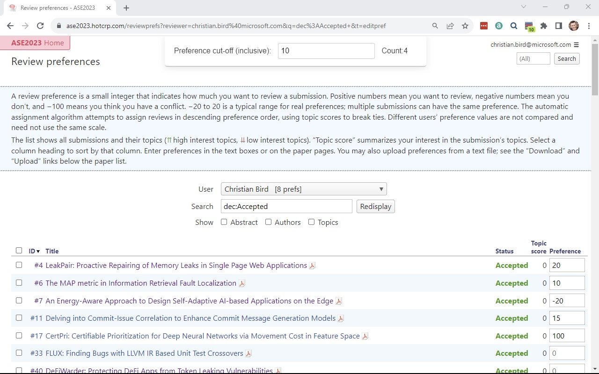

# HotCRP Bidding Counter Extension

This Chrome extension provides a convenient way to count and display the number of review preferences or bids above a specified threshold on HotCRP.



## Features

- **Floating Counter**: A floating UI element is added to the HotCRP review preferences page, allowing users to specify a threshold and see the count of reviews/preferences above that threshold.
- **Dynamic Counting**: The count updates dynamically as users change their review preferences.
- **User-friendly**: Designed with a clear and intuitive interface with the count always visible.

## Installation

There are two ways to install this extension: from the Chrome Web Store (the recommended way) or from source.

### From the Chrome Web Store

1. Navigate to the [Chrome Web Store page](https://chrome.google.com/webstore/detail/hotcrp-bidding-counter/okjgjgjgjgjgjgjgjgjgjgjgjgjgjgj).
2. Click "Add to Chrome".
3. Navigate to a HotCRP review preferences page to use the extension.

### From Source

1. Clone this repository
```
git clone https://github.com/cabird/hotcrp-pref-counter-extension.git
```
2. Navigate to `chrome://extensions/` in your Chrome browser.
3. Enable "Developer mode" (usually a toggle switch in the top right corner).
4. Click "Load unpacked" and select the directory where you cloned this repository.
5. The extension should now be added to your Chrome browser.

## Usage

1. Navigate to a HotCRP review preferences page.
2. Use the floating UI element to set your desired threshold.
3. The extension will display the count of reviews/preferences above the specified threshold.

## Contributing

Pull requests are welcome or feature requests are welcome.

## License

[MIT](https://choosealicense.com/licenses/mit/)
