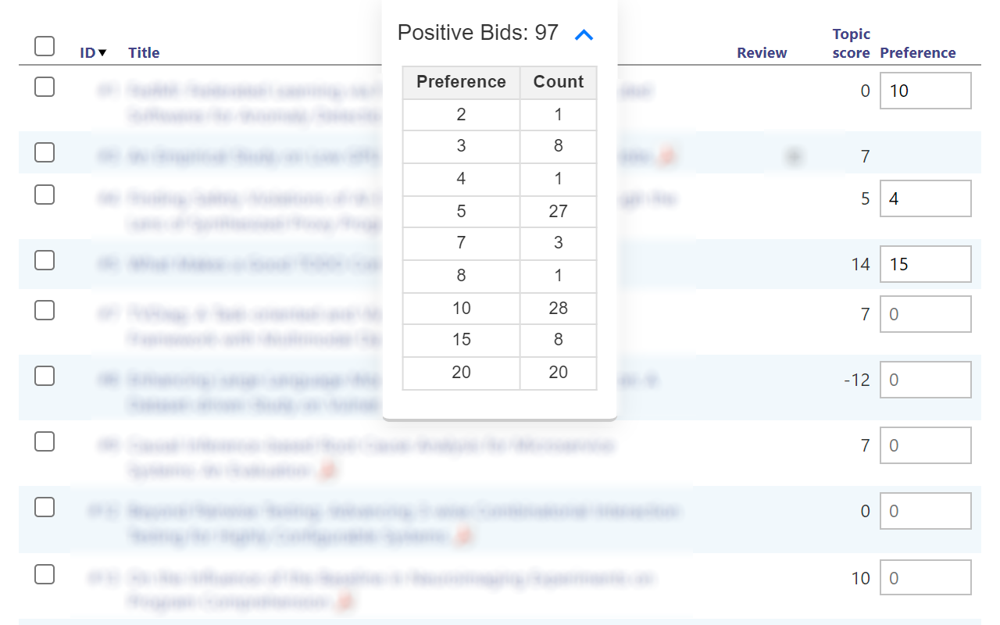

# HotCRP Bidding Counter Extension

This Chrome extension provides a convenient way to count and display the number of positive bids/preferences and also show a table of the counts of each preference level.

 



## Features

- **Floating Counter**: A floating UI element is added to the HotCRP review preferences page
- **User-friendly**: Designed with a clear and intuitive interface with the count always visible.

## Installation

There are two ways to install this extension: from the Chrome Web Store (the recommended way) or from source.

### From the Chrome Web Store

1. Navigate to the [Chrome Web Store page](https://chrome.google.com/webstore/detail/hotcrp-bidpreference-coun/dooaffdcgmcboancmlbihgmbacghghaj).
2. Click "Add to Chrome".

### From Source

1. Clone this repository
```
git clone https://github.com/cabird/hotcrp-pref-counter-extension.git
```
2. Navigate to `chrome://extensions/` in your Chrome browser.
3. Enable "Developer mode" (usually a toggle switch in the top right corner).
4. Click "Load unpacked" and select the `src/` subdirectory within this repository.


## Usage

1. Navigate to a HotCRP review preferences page.
2. The counter should appear automatically.
3. Click on the expand/minimize icon to show or hide the table of counts of each preference level.


## Contributing

Pull requests or feature requests are welcome.

## License

[MIT](https://choosealicense.com/licenses/mit/)
